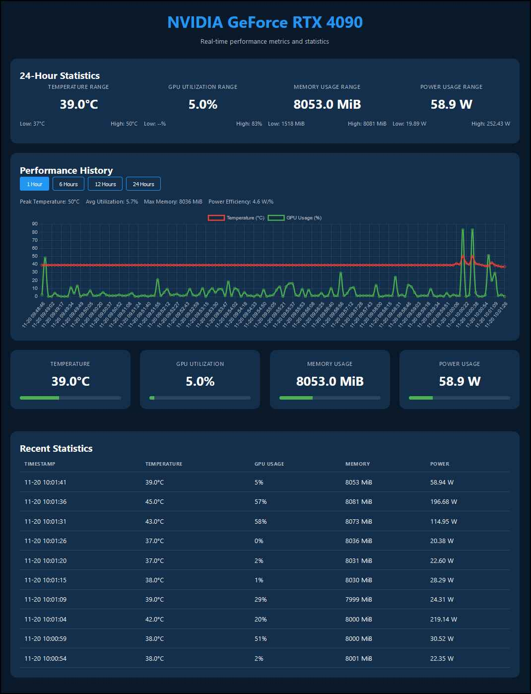
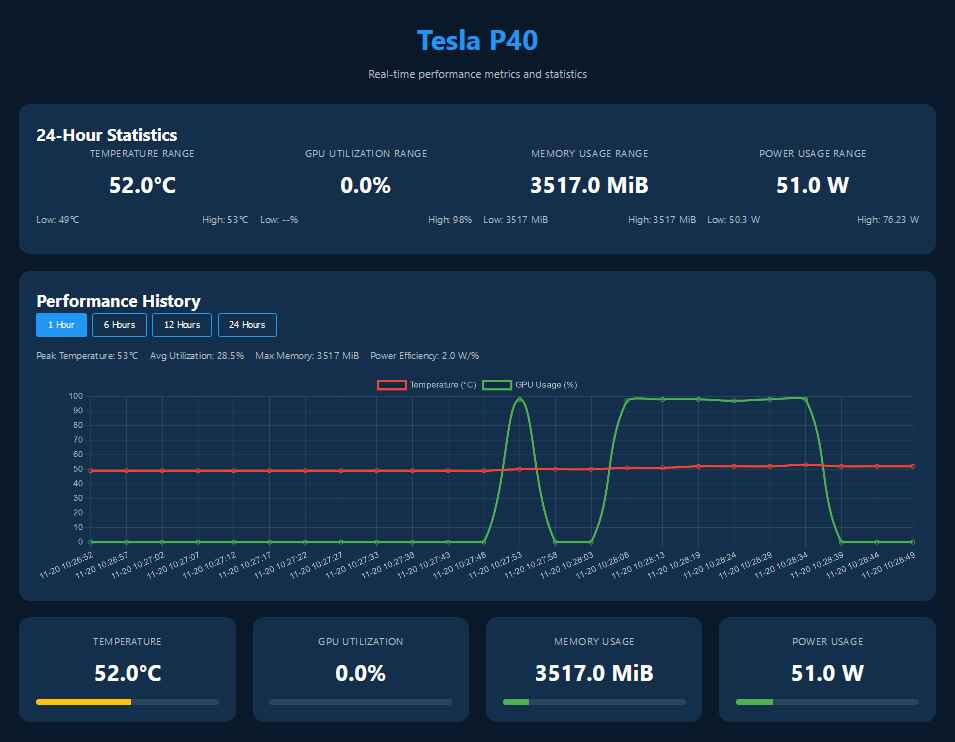

[](https://github.com/bigsk1/gpu-monitor/blob/main/LICENSE)


# Nvidia GPU Dashboard

A real-time NVIDIA GPU monitoring dashboard built with Docker for easy deployment and cross-platform compatibility.



## Features

- Real-time GPU metrics monitoring
- Interactive web dashboard
- Historical data tracking (1h, 6h, 12h, 24h)
- Temperature, utilization, memory, and power monitoring
- Docker-based for easy deployment
- Your GPU name shown in UI


## Prerequisites

- Docker
- NVIDIA GPU with drivers installed
- NVIDIA Container Toolkit

## Quick Start

### Using Pre-built Image Docker Run

```bash
docker run -d \
  --name gpu-monitor \
  --restart unless-stopped \
  --gpus all \
  -p 8081:8081 \
  -e TZ=America/Los_Angeles \ # Add your timezone
  -v /etc/localtime:/etc/localtime:ro \
  ghcr.io/bigsk1/gpu-monitor:latest
```

### Using Docker Compose

1. Clone the repository:
```bash
git clone https://github.com/bigsk1/gpu-monitor.git
cd gpu-monitor
```

2. Start the container:
```bash
docker-compose up -d
```

3. Access the dashboard at: `http://localhost:8081/gpu_stats.html`


## Installation Prerequisites

### 1. Install NVIDIA Container Toolkit

For Ubuntu/Debian:
```bash
# Add NVIDIA package repositories
distribution=$(. /etc/os-release;echo $ID$VERSION_ID)
curl -s -L https://nvidia.github.io/nvidia-docker/gpgkey | sudo apt-key add -
curl -s -L https://nvidia.github.io/nvidia-docker/$distribution/nvidia-docker.list | sudo tee /etc/apt/sources.list.d/nvidia-docker.list

# Install nvidia-docker2
sudo apt-get update
sudo apt-get install -y nvidia-docker2

# Restart Docker daemon
sudo systemctl restart docker
```

For other distributions, check the [official documentation](https://docs.nvidia.com/datacenter/cloud-native/container-toolkit/install-guide.html).


## Building from Source

1. Clone the repository:
```bash
git clone https://github.com/bigsk1/gpu-monitor.git
cd gpu-monitor
```

2. Build the image:
```bash
docker build -t gpu-monitor .
```

3. Run the container:
```bash
docker run -d \
  --name gpu-monitor \
  --restart unless-stopped \
  --gpus all \
  -p 8081:8081 \
  -e TZ=America/Los_Angeles \ # Add you timezone
  -v /etc/localtime:/etc/localtime:ro \
  gpu-monitor
```

## Configuration

The dashboard is accessible at `http://localhost:8081/gpu_stats.html` by default. To change the port, modify the `docker-compose.yml` file or the `-p` parameter in the docker run command.

--- 




## Development

### Project Structure
```
gpu-monitor/
├── Dockerfile
├── docker-compose.yml
├── gpu_stats.html
├── monitor_gpu.sh
├── README.md
└── .gitignore
```

## Alternative Setup Method (linux)

A setup script is provided for convenience. It checks prerequisites and manages the service:

```bash
# Check prerequisites and start the service
./setup.sh start

# Stop the service
./setup.sh stop

# Restart the service
./setup.sh restart

# Check service status
./setup.sh status

# View logs
./setup.sh logs
```

Example of starting and building a container
```bash
user@ai:~/gpu-monitor$ ./setup.sh start
[+] Checking prerequisites...
[+] Docker: Found
[+] Docker Compose: Found
[+] NVIDIA Docker Runtime: Found
[+] NVIDIA GPU: Found
[+] Starting GPU Monitor...
Creating network "gpu-monitor_default" with the default driver
Creating gpu-monitor ... done
[+] GPU Monitor started successfully!
[+] Dashboard available at: http://localhost:8081/gpu_stats.html
[+] To check logs: docker-compose logs -f
```


## Data Persistence

By default, all data is stored within the container for optimal performance and cleanup. If you need to persist data between container rebuilds, modify the docker-compose.yml:

```yaml
services:
  gpu-monitor:
    # ... other settings ...
    volumes:
      - ./data:/app/data    # Persist historical data
      - ./logs:/app/logs    # Persist logs
```

## Troubleshooting

### Common Issues

1. **NVIDIA SMI not found**
   - Ensure NVIDIA drivers are installed
   - Verify NVIDIA Container Toolkit installation

2. **Container fails to start**
   - Check Docker logs: `docker logs gpu-monitor`
   - Verify GPU access: `nvidia-smi`
   - Ensure proper permissions

3. **Dashboard not accessible**
   - Verify container is running: `docker ps`
   - Check container logs: `docker logs gpu-monitor`
   - Ensure port 8081 is not in use
4. **Timezone is off**

  Note: Replace America/Los_Angeles with your timezone if different. Common timezones:

US Eastern: America/New_York

US Central: America/Chicago

US Mountain: America/Denver

US Pacific: America/Los_Angeles


## License

MIT License - see [LICENSE](LICENSE) file for details.